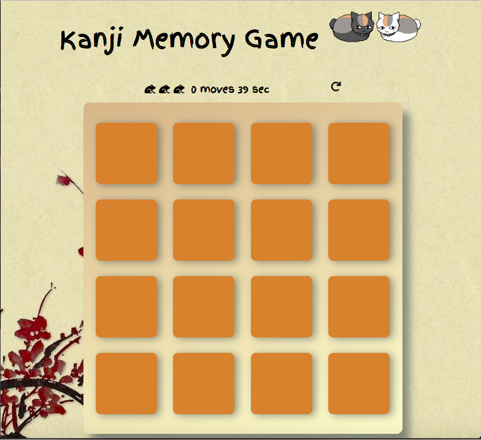

# Kanji Memory Game

Match the Kanji with their meaning before time runs up!

Gameplay:
1. The player can flip 2 cards at a time, which shall be counted as one move
2. If the kanji is matched with its meaning the cards turn yellow and remain static
3. If not they shall flip over again after a short period of time, allowing the user to memorise them
4. The number of frogs awarded to player is calculated by the number of moves
4. Number of time taken by player is tracked alongside
5. If game is completed within time limit, the game is won. Time taken, moves and frogs won are displayed

NOTE: Choice of Kanji available is kept minimum for now for testing purposes